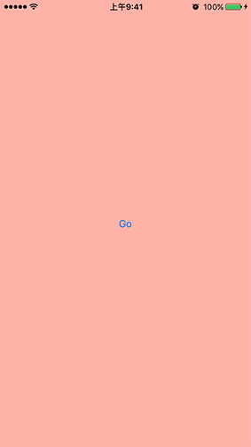

# CollapseTransitioning

预览



1.接受协议
```
@interface FirstViewController : UIViewController <UIViewControllerTransitioningDelegate>
```

2.设置transitioningDelegate
```
SecondViewController *secView = [[SecondViewController alloc] init];
secView.transitioningDelegate = self;
[self presentViewController:secView animated:YES completion:nil];
```

3.实现animationControllerForDismissedController方法，返回一个SACCollapseAnimator对象，可自定义过场时间和碎片大小
```
- (id<UIViewControllerAnimatedTransitioning>)animationControllerForDismissedController:(UIViewController *)dismissed {

    SACCollapseAnimator *animator = [[SACCollapseAnimator alloc] init];
    //animator.duration = 1;
    //animator.sideLength = 8;
    return animator;
}
```